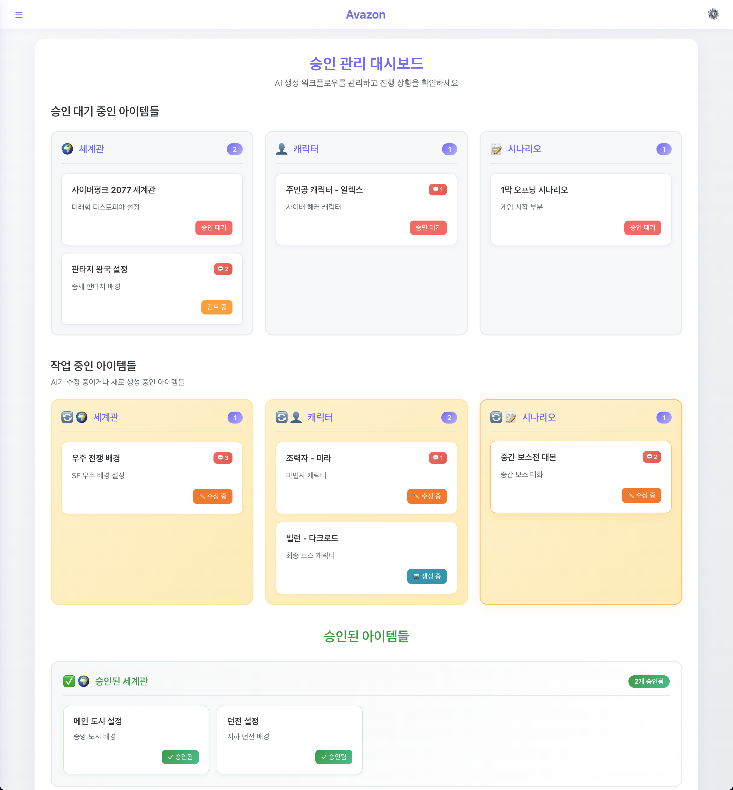

# Avazon Dashboard

반응형 승인 관리 대시보드입니다. 웹과 모바일에서 모두 사용할 수 있습니다.

## 주요 기능

### Dashboard
- **승인 대기 중인 아이템들**을 칸반 보드 형태로 관리
  - 세계관 아이템 리스트
  - 캐릭터 아이템 리스트  
  - 시나리오 및 대본 리스트
- **승인된 아이템들** 확인
  - 승인된 세계관
  - 승인된 캐릭터
  - 승인된 시나리오

### Analysis
- 승인 프로세스 분석 (개발 예정)
- 처리 시간 통계 (개발 예정)
- 콘텐츠 품질 지표 (개발 예정)

### Setting
- 알림 설정 (이메일, 푸시, Slack)
- 승인 프로세스 설정
- 화면 표시 옵션

## 디자인 특징

- **메인 컬러**: `#8370FE`, `#C0B7FF`
- **둥근 사각형** 디자인으로 모던한 UI
- **완전 반응형** - 웹과 모바일 모두 최적화
- **칸반 보드** 스타일의 워크플로우 관리

## 현재 디자인


## 설치 및 실행

### 1. 의존성 설치
```bash
npm install
```

### 2. 개발 서버 시작
```bash
npm start
```

브라우저에서 [http://localhost:3000](http://localhost:3000)을 열어 확인하세요.

## 개발 모드 설정

### 테스트용 로그인
서버가 없거나 개발 중일 때 테스트용 로그인을 사용할 수 있습니다.

`.env` 파일에서 개발 모드를 활성화:
```env
REACT_APP_DEV_MODE=true
```

개발 모드가 활성화되면:
- **아이디**: `admin`
- **비밀번호**: `admin`
- 로그인 페이지에 테스트 로그인 힌트가 표시됩니다.
- 서버 연결 실패 시에도 admin/admin으로 로그인 가능합니다.

### 개발 모드 비활성화
운영 환경에서는 반드시 개발 모드를 비활성화하세요:
```env
REACT_APP_DEV_MODE=false
```

### 3. 빌드
```bash
npm run build
```

## 기술 스택

- **React** 18.2.0
- **CSS3** (Grid, Flexbox)
- **Responsive Design**
- **Modern JavaScript (ES6+)**

## 프로젝트 구조

```
src/
├── components/
│   ├── Dashboard.js     # 메인 대시보드
│   ├── Dashboard.css
│   ├── Analysis.js      # 분석 페이지
│   ├── Analysis.css
│   ├── Setting.js       # 설정 페이지
│   └── Setting.css
├── App.js              # 메인 앱 컴포넌트
├── App.css
├── index.js            # 엔트리 포인트
└── index.css           # 글로벌 스타일
```
